Here’s your fixed and polished README:

# 🚀 CICDTestProject  

## 🎯 Project Purpose  
The **CICDTestProject** demonstrates two main goals:  

1. **Frontend SPA Setup** → Show how to configure and run a frontend project as a **Single Page Application (SPA)** with a .NET backend.  
2. **CI/CD Automation** → Showcase a working **Continuous Integration & Deployment pipeline** using GitHub Actions and Docker.  

This makes the repo both a **learning tool** and a **portfolio-ready DevOps showcase**.  

---

## 🖥️ 1. Run the Frontend with SPA Configured  

The project integrates a **frontend SPA** with a backend API.  

### 🔹 Steps to Run Locally  

```bash
# Clone the repo
git clone https://github.com/youcefbourouba17/CICDTestProject.git
cd CICDTestProject

# Run the backend (C# / .NET)
dotnet run

# Run the frontend (TypeScript / JavaScript SPA)
cd frontend
npm install
npm start
```

👉 Once running, the backend serves as the API layer, and the SPA frontend consumes it.
The SPA configuration allows client-side routing while keeping a clean integration with the backend.

🔄 2. CI/CD Workflow

The project uses GitHub Actions to build, test, and deploy automatically.
Every push to the repository triggers the pipeline.

```mermaid
flowchart TB
    subgraph CICD["⚡ CI/CD Pipeline"]
        direction TB
        A[Developer Pushes Code] --> B[GitHub Actions Triggered]
        B --> C[Build Stage 🛠️]
        C --> D[Run Unit Tests 🧪]
        D --> E{Tests Passed?}
        E -- No ❌ --> F[Notify Failure 🚨]
        E -- Yes ✅ --> G[Build Docker Image 🐳]
        G --> H[Deploy to Environment 🌍]
        H --> I[Notify Success ✅]
    end

```

🔹 Pipeline Stages

Build → Compiles backend & frontend

Test → Runs automated unit/integration tests

Dockerize → Builds Docker image for consistent environments

Deploy → Pushes to target environment (e.g., staging/production)

🛠️ Tech Stack

Backend → C# / .NET

Frontend → TypeScript / JavaScript (SPA)

Automation → GitHub Actions

Containerization → Docker

✅ Roadmap

 Add automated test coverage reports

 Deploy to cloud provider (Azure / AWS / GCP)

 Add CI/CD status badges to this README

 Provide demo link / screenshots

📌 Author

Made with ❤️ by Youcef Bourouba
